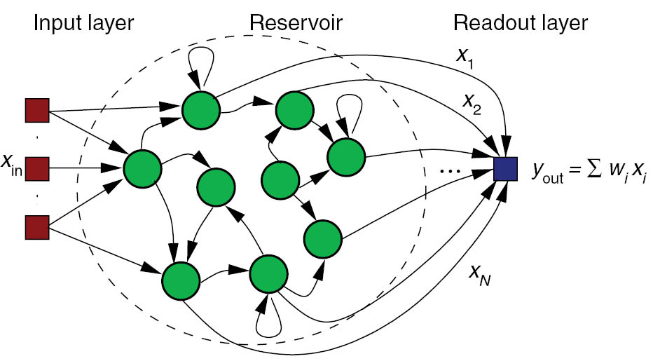
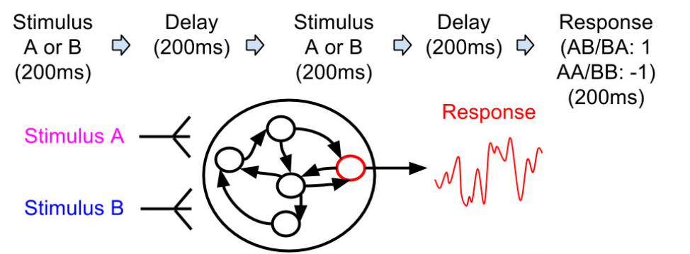

+++
title = "Introduction to ANNarchy"
authors = ["Julien Vitay"]

[slides]
theme = "white"
highlight_style = "github"
+++


# ANNarchy (Artificial Neural Networks architect)

# Julien Vitay

---

## ANNarchy (Artificial Neural Networks architect)


Source code:

<https://bitbucket.org/annarchy/annarchy>

Documentation:

<https://annarchy.readthedocs.io/en/stable/>

Forum:

<https://groups.google.com/forum/#!forum/annarchy>

Notebooks used in this tutorial:

<https://github.com/vitay/ANNarchy-notebooks>

---

## Installation

Installation guide: <https://annarchy.readthedocs.io/en/stable/intro/Installation.html>

From pip:

```bash
pip install ANNarchy
```

From source:

```bash
git clone https://bitbucket.org/annarchy/annarchy.git
cd annarchy
python setup.py install
```

Requirements (Linux and MacOS):

* g++/clang++, python 2.7 or 3.5+, numpy, scipy, matplotlib, sympy, cython


---

## Features

* Simulation of both **rate-coded** and **spiking** neural networks.

* Only local biologically realistic mechanisms are possible (no backpropagation).

* **Equation-oriented** description of neural/synaptic dynamics (à la Brian).

* **Code generation** in C++, parallelized using OpenMP on CPU and CUDA on GPU (MPI is coming).

* Synaptic, intrinsic and structural plasticity mechanisms.


---


---

## Structure of a script

```python
from ANNarchy import *
setup(dt=1.0)

neuron = Neuron(...) # Create neuron types

stdp = Synapse(...) # Create synapse types for transmission and/or plasticity

pop = Population(1000, neuron) # Create populations of neurons

proj = Projection(pop, pop, 'exc', stdp) # Connect the populations
proj.connect_fixed_probability(weights=0.0, probability=0.1)

compile() # Generate and compile the code

m = Monitor(pop, ['spike']) # Record spikes

simulate(1000.) # Simulate for 1 second

data = m.get('spike') # Retrieve the data and plot it
```

---

# 1 - Rate-coded networks

---

## Example 1 : Echo-State Network



---

## Echo-State Network

ESN rate-coded neurons typically follow first-order ODEs:

$$
    \tau \frac{dx(t)}{dt} + x(t) = \sum w^\text{in} \, r^\text{in}(t) + g \, \sum w^\text{rec} \, r(t) + \xi(t)
$$

$$
    r(t) = \tanh(x(t))
$$

```python
from ANNarchy import *

ESN_Neuron = Neuron(
    parameters = """
        tau = 30.0                 # Time constant
        g = 1.0 : population       # Scaling
        noise = 0.01 : population  # Noise amplitude
    """,
    equations="""
        tau * dx/dt + x = sum(in) + g * sum(exc) + noise * Uniform(-1, 1) : init=0.0

        r = tanh(x)
    """
)
```

---

## Parameters

```python
    parameters = """
        tau = 30.0 # Time constant
        g = 1.0 : population # Scaling
        noise = 0.01 : population # Noise amplitude
    """
```

All parameters used in the equations must be declared in the **Neuron** definition.

Parameters can have one value per neuron in the population (default) or be common to all neurons (flag `population` or `projection`).

Parameters and variables are double floats by default, but the type can be specified (`int`, `bool`).

---

## Variables

```python
    equations="""
        tau * dx/dt + x = sum(in) + g * sum(exc) + noise * Uniform(-1, 1) : init=0.0

        r = tanh(x)
    """
```

Variables are evaluated at each time step *in the order of their declaration*, except for coupled ODEs.

Variables can be updated with assignments (`=`, `+=`, etc) or by defining first order ODEs.

The math C library symbols can be used (`tanh`, `cos`, `exp`, etc).

Initial values at $t=0$ can be specified with `init` (default: 0.0).

Lower/higher bounds on the values of the variables can be set with the `min`/`max` flags:

```
r = x : min=0.0 # ReLU
```

Additive noise can be drawn from several distributions, including `Uniform`, `Normal`, `LogNormal`, `Exponential`, `Gamma`...

The output variable of a rate-coded neuron **must** be `r`.

---

## ODEs

First-order ODEs are parsed and manipulated using `sympy`:

```python
    # All equivalent:
    tau * dx/dt + x = 0.0
    tau * dx/dt = - x
    dx/dt = (-x)/tau
```

Several numerical methods are available (<https://annarchy.readthedocs.io/en/stable/manual/NumericalMethods.html>):

* Explicit (forward) Euler (default): `tau * dx/dt + x = 0.0 : init=0.0, explicit`

* Implicit (backward) Euler: `tau * dx/dt + x = 0.0 : init=0.0, implicit`

* Exponential Euler (exact for linear ODE): `tau * dx/dt + x = 0.0 : init=0.0, exponential`

* Midpoint (RK2): `tau * dx/dt + x = 0.0 : init=0.0, midpoint`

* Event-driven (spiking synapses): `tau * dx/dt + x = 0.0 : init=0.0, event-driven`

---

## Coupled ODEs

ODEs are solved concurrently, instead of sequentially for assignments:

```python
# I is updated
I = sum(exc) - sum(inh) + b

# u and v are solved concurrently using the current of I
tau * dv/dt + v = I - u
tau * du/dt + u = v

# r uses the updated value of v
r = tanh(v)
```

The order of the equations therefore matters a lot.

A single variable can only be updated once in the `equations` field.

---

## Populations

Populations are creating by specifying a number of neurons and a neuron type:

```python
pop = Population(1000, ESN_Neuron)
```

For visualization purposes or when using convolutional layers, a tuple geometry can be passed instead of the size:

```python
pop = Population((100, 100), ESN_Neuron)
```

All parameters and variables become attributes of the population (read and write) as numpy arrays:

```python
pop.tau = np.linspace(20.0, 40.0, 1000)
pop.r = np.tanh(pop.v)
```

Single neurons can be individually modified, if the `population` flag was not set:

```python
pop[10].r = 1.0
```

Slices of populations are called `PopulationView` and can be addressed separately:

```python
pop = Population(1000, ESN_Neuron)
E = pop[:800]
I = pop[800:]
```

---

## Projections

Projections link two populations (or views) in a uni-directional way.

```python
proj_exc = Projection(E, pop, 'exc')
proj_inh = Projection(I, pop, 'inh')
```

Each target (`'exc', 'inh', 'AMPA', 'NMDA', 'GABA'`) can be defined as needed and will be treated differently by the post-synaptic neurons.

The weighted sum of inputs for a specific target is accessed in the equations by `sum(target)`:

```python
    equations="""
        tau * dx/dt + x = sum(exc) - sum(inh)

        r = tanh(x)
    """
```

It is therefore possible to model modulatory effects, divisive inhibition, etc.

---

## Connection methods

Projections must be populated with a connectivity matrix (who is connected to who), a weight `w` and optionally a delay `d` (uniform or variable).

Several patterns are predefined:

```python
proj.connect_all_to_all(weights=Normal(0.0, 1.0), delays=2.0, allow_self_connections=False)
proj.connect_one_to_one(weights=1.0, delays=Uniform(1.0, 10.0))
proj.connect_fixed_number_pre(number=20, weights=1.0)
proj.connect_fixed_number_post(number=20, weights=1.0)
proj.connect_fixed_probability(probability=0.2, weights=1.0)
proj.connect_gaussian(amp=1.0, sigma=0.2, limit=0.001)
proj.connect_dog(amp_pos=1.0, sigma_pos=0.2, amp_neg=0.3, sigma_neg=0.7, limit=0.001)
```

But you can also load Numpy arrays or Scipy sparse matrices. Example for synfire chains:

```python
w = np.array([[None]*pre.size]*post.size)
for i in range(post.size):
    w[i, (i-1)%pre.size] = 1.0
proj.connect_from_matrix(w)

w = lil_matrix((pre.size, post.size))
for i in range(pre.size):
    w[pre.size, (i+1)%post.size] = 1.0
proj.connect_from_sparse(w)
```

---

## Compiling and running the simulation

Once all populations and projections are created, you have to generate to the C++ code and compile it:

```python
compile()
```

You can now manipulate all parameters/variables from Python thanks to the Cython bindings.

A simulation is simply run for a fixed duration with:

```python
simulate(1000.) # 1 second
```

You can also run a simulation until a criteria is filled, check:

<https://annarchy.readthedocs.io/en/stable/manual/Simulation.html#early-stopping>

---

## Monitoring

By default, a simulation is run in C++ without interaction with Python.

You may want to record some variables (neural or synaptic) during the simulation with a `Monitor`:

```python
m = Monitor(pop, ['v', 'r'])
n = Monitor(proj, ['w'])
```

After the simulation, you can retrieve the recordings with:

```python
recorded_v = m.get('v')
recorded_r = m.get('r')
recorded_w = n.get('w')
```

Warning: calling `get()` flushes the array.

Warning: recording projections can quickly fill up the RAM (see Dendrites).

---

# Example 1: Echo-State Network

Link to the Jupyter notebook on github: [RC.ipynb](https://github.com/vitay/ANNarchy-notebooks/blob/master/notebooks/RC.ipynb)


---

# 2 - Spiking networks

---

## Spiking neurons

Spiking neurons must also define two additional fields:

* `spike`: condition for emitting a spike.

* `reset`: what happens after a spike is emitted (at the start of the refractory period).

A refractory period in ms can also be specified.

Example of the Leaky Integrate-and-Fire:

```python
LIF = Neuron(
    parameters="""
        tau = 20.
        E_L = -70.
        v_T = 0.
        v_r = -58.
        I = 50.0
    """,
    equations="""
        tau * dv/dt = (E_L - v) + I : init=E_L     
    """,
    spike=" v >= v_T ",
    reset=" v = v_r ",
    refractory = 2.0
)
```

---

## Conductances / currents

A pre-synaptic spike arriving to a spiking neuron increase the conductance `g_target` (e.g. `g_exc` or `g_inh`, depending on the projection).

```python
LIF = Neuron(
    parameters="...",
    equations="""
        tau * dv/dt = (E_L - v) + g_exc - g_inh   
    """,
    spike=" v >= v_T ",
    reset=" v = v_r ",
    refractory = 2.0
)
```

Each spike increments `g_target` from the synaptic efficiency `w` of the corresponding synapse.

```
g_target += w
```

This defines an instantaneous model of synaptic transmission.

---

## Conductances / currents

For **exponentially-decreasing** or **alpha-shaped** synapses, ODEs have to be introduced for the conductance/current.

The exponential numerical method should be preferred, as integration is exact.

```python
LIF = Neuron(
    parameters="...",
    equations="""
        tau * dv/dt = (E_L - v) + g_exc + alpha_exc # exponential or alpha

        tau_exc * dg_exc/dt = - g_exc : exponential

        tau_exc * dalpha_exc/dt = exp((tau_exc - dt/2.0)/tau_exc) * g_exc
                                                        - alpha_exc  : exponential
    """,
    spike=" v >= v_T ",
    reset=" v = v_r ",
    refractory = 2.0
)
```

---

## Conductances / currents


---

## Example 2: AdEx - Adaptive exponential neuron

Link to the Jupyter notebook on github: [AdEx.ipynb](https://github.com/vitay/ANNarchy-notebooks/blob/master/notebooks/AdEx.ipynb)

$$
    \tau \, \frac{dv}{dt} = (E_L - v) + \delta_T \, \exp \frac{v-v_T}{\delta_T} + I - w
$$
$$
    \tau_w \, \frac{dw}{dt} =  a \, (v - E_L) - w
$$

```python
AdEx = Neuron(
    parameters="""
        tau = 20.
        E_L = -70.
        v_T = -50. ; v_r = -58.
        delta_T = 2.0
        a = 0.2 ; b = 0.
        tau_w = 30.
        I = 50.0
    """,
    equations="""
        tau * dv/dt = (E_L - v) + delta_T * exp((v-v_T)/delta_T) + I - w : init=E_L     
        tau_w * dw/dt = a * (v - E_L) - w  : init=0.0
    """,
    spike=" v >= 0.0 ",
    reset=" v = v_r ; w += b ",
    refractory = 2.0
)
```

---

# 3 - Synaptic plasticity

---

## Rate-coded synapses : Intrator & Cooper BCM learning rule

Synapses can also implement equations that will be evaluated after each neural update.

```python
IBCM = Synapse(
    parameters = """
        eta = 0.01 : projection
        tau = 2000.0 : projection
    """,
    equations = """
        tau * dtheta/dt + theta = post.r^2 : postsynaptic, exponential

        dw/dt = eta * post.r * (post.r - theta) * pre.r : min=0.0, explicit
    """,
    psp = " w * pre.r"
)
```

The synaptic efficiency (weight) must be `w`.

Each synapse can access pre- and post-synaptic variables with `pre.` and `post.`.

The `postsynaptic` flag allows to do computations only once per post-synaptic neurons.

`psp` optionally defines what will be summed by the post-synaptic neuron (e.g. `psp = "w * log(pre.r)"`).

---

## Plastic projections

The synapse type just has to be passed to the Projection:

```python
proj = Projection(inp, pop, 'exc', IBCM)
```

Synaptic variables can be accessed as lists of lists for the whole projection:

```python
proj.w
proj.theta
```

or for a single post-synaptic neuron (`Dendrite`):

```python
proj[10].w
```

---

## Example 3: Miconi's reward modulated RC network

Link to the Jupyter notebook on github: [Miconi.ipynb](https://github.com/vitay/ANNarchy-notebooks/blob/master/notebooks/Miconi.ipynb)



---

## Spiking synapses : Example of Short-term plasticity (STP)

Spiking synapses can define a `pre_spike` field, defining what happens when a pre-synaptic spike arrives at the synapse.

`g_target` is an alias for the corresponding post-synaptic conductance: it will be replaced by `g_exc` or `g_inh` depending on how the synapse is used.

By default, a pre-synaptic spike increments the post-synaptic conductance from `w`: `g_target += w`

```python
STP = Synapse(
    parameters = """
        tau_rec = 100.0 : projection
        tau_facil = 0.01 : projection
        U = 0.5
    """,
    equations = """
        dx/dt = (1 - x)/tau_rec : init = 1.0, event-driven
        du/dt = (U - u)/tau_facil : init = 0.5, event-driven
    """,
    pre_spike="""
        g_target += w * u * x
        x *= (1 - u)
        u += U * (1 - u)
    """
)
```

---

## Spiking synapses : Example of Spike-Timing Dependent plasticity (STDP)

`post_spike` similarly defines what happens when a post-synaptic spike is emitted.

```python
STDP = Synapse(
    parameters = """
        tau_plus = 20.0 : projection ; tau_minus = 20.0 : projection
        A_plus = 0.01 : projection   ; A_minus = 0.01 : projection
        w_min = 0.0 : projection     ; w_max = 1.0 : projection
    """,
    equations = """
        tau_plus  * dx/dt = -x : event-driven # pre-synaptic trace
        tau_minus * dy/dt = -y : event-driven # post-synaptic trace
    """,
    pre_spike="""
        g_target += w
        x += A_plus * w_max
        w = clip(w + y, w_min , w_max)
    """,
    post_spike="""
        y -= A_minus * w_max
        w = clip(w + x, w_min , w_max)
    """)
```
---


## Spiking synapses : Example of Spike-Timing Dependent plasticity (STDP)


---

## And much more...

* Standard populations (`SpikeSourceArray`, `TimedArray`, `PoissonPopulation`, `HomogeneousCorrelatedSpikeTrains`), OpenCV bindings.

* Standard neurons:

    * LeakyIntegrator, Izhikevich, IF_curr_exp, IF_cond_exp, IF_curr_alpha, IF_cond_alpha, HH_cond_exp, EIF_cond_exp_isfa_ista, EIF_cond_alpha_isfa_ista

* Standard synapses:

    * Hebb, Oja, IBCM, STP, STDP

* Parallel simulations with `parallel_run`.

* Convolutional and pooling layers.

* Hybrid rate-coded / spiking networks.

* Structural plasticity.

RTFD: <https://annarchy.readthedocs.io>
